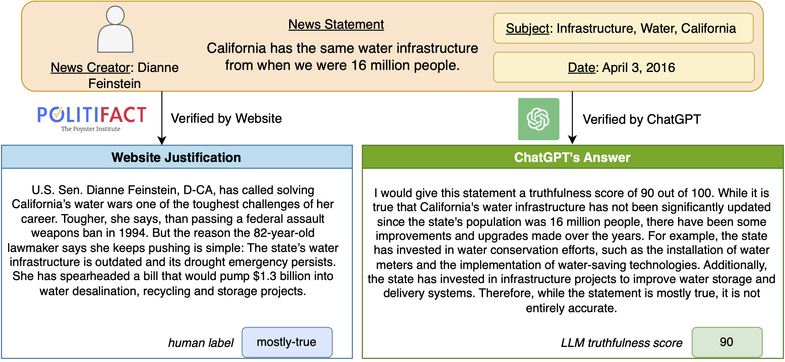

**Abstract**

> The proliferation of fake news has emerged as a critical issue in recent years, requiring significant efforts to detect it. However, the ex- isting fake news detection datasets are sourced from human journalists, which are likely to have inherent bias limitations due to the highly subjective nature of this task. In this paper, we revisit the existing fake news dataset verified by human journalists with augmented fact-checking by large language models (ChatGPT), and we name the augmented fake news dataset ChatGPT-FC. We quantitatively analyze the distinctions and resemblances between human journalists and LLM in assessing news subject credibility, news creator credibility, time-sensitive, and political framing. Our findings highlight LLM’s potential to serve as a preliminary screening method, offering a promising avenue to mitigate the inherent biases of human journalists and enhance fake news detection.

**Overview**
- We introduce the ChatGPT-FC dataset, which includes the fact-checking reports written by both human journalists and the complementary information generated by ChatGPT. To the best of our knowledge, ChatGPT-FC is the first dataset that provides not only the human-verified fact-checking source but also another qualified checking view from LLMs.
- We developed an evaluation framework to assess the quality of fact-checking content from both human journalists and LLMs, showing that the involvement of LLMs in fact-checking provides a valuable perspective, complementing the subjective nature of human ratings influenced by various factors.
 

**Data Collection**

The data we collected and studied in the ChatGPT-FC dataset comes from the news fact-checking website PolitiFact, spanning from 2007 to 2023. PolitiFact was founded in 2007 as an election-year project of the Tampa Bay Times, where journalists fact-check influential statements made by politi- cians or on social media. We crawled a total number of 22,337 news statements from 4,636 creators across 23 affiliations in the ChatGPT-FC dataset. Each fact-checking report provides a clear fact-checking label selected from the pre-defined 6-level label set ({True, Mostly True, Half True, Barely True, False, Pants on Fire}), where True represents the completely accurate statements and Pants on Fire represents the completely false statements based on the news authenticity. Among all the statements checked by journalists, there are 7,016 true statements, and 15,321 fake statements3.

On the other side, to utilize the ChatGPT API (text-davinci-003) for fact-checking the crawled news statements, we create a fact-checking prompt that includes the raw statement and fact-checking instructions. This query prompt will guide ChatGPT to generate truthfulness scores and supporting evidence, enabling us to evaluate the quality of ChatGPT’s generated text in terms of its semantic content and fact-checking score.

